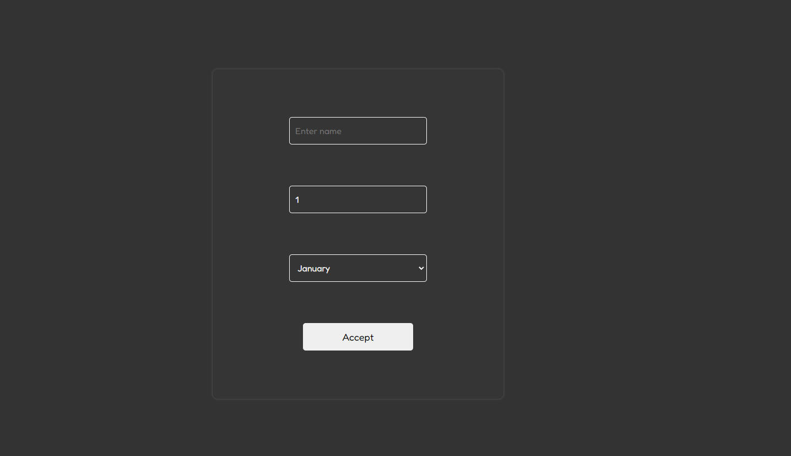
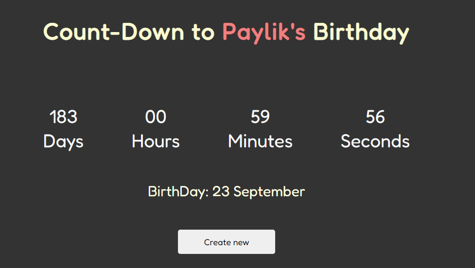

# 🎉Birthday Wisher with Countdown!🎉

Made with React with Hooks.

## Getting started

You can view a live demo over at https://birthday-react-tapi33.netlify.app/

To get It running locally:

- Clone this repo
- `npm install` to install all req'd dependencies
- `npm start` to start the local server (this project uses create-react-app)

## Usage:

Click on Generate Link
or Head to [https://birthday-wisher.netlify.app/]()

Enter the `name , day , month of birthday`

Click on Accept button

## ScreenShot of Coutdown Timer⏲️

Countdown Compenent Page : `Countdown.jsx`